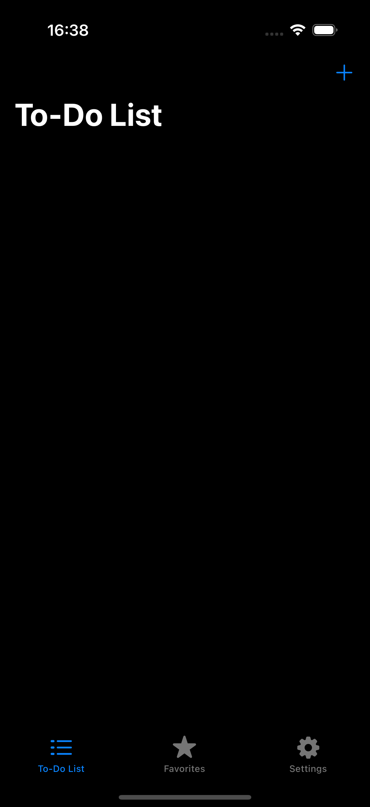

# ToDoList App mit Swift und SwiftUI

## Beschreibung

Die **ToDoList App** ist eine moderne und benutzerfreundliche Aufgabenverwaltungsanwendung, die mit **Swift** und **SwiftUI** entwickelt wurde. Mit dieser App können Benutzer ihre Aufgaben einfach verwalten, den Dark Mode und Light Mode verwenden und ihre Lieblingsaufgaben speichern. Die App bietet eine benutzerfreundliche Oberfläche mit einer Einstellungsseite, in der Benutzer den Modus auswählen können.

### Funktionen:

- **Dark Mode und Light Mode**: Wählen Sie je nach Vorliebe zwischen den Modi.
- **Favoriten**: Markiere deine wichtigsten Aufgaben mit einem Stern und greife schnell auf sie über die Seite "Favoriten" zu.
- **Einstellungsseite**: Passe die App nach deinen Bedürfnissen an. Du kannst zwischen Dark Mode und Light Mode wechseln und weitere Einstellungen vornehmen.
- **Aufgabenverwaltung**: Füge, bearbeite und lösche deine Aufgaben.
- **Kontaktseite**: Eine Seite mit einer Einleitung und Kontaktdaten, um den Entwickler zu kontaktieren.

## Screenshots



## Installation

1. Klone dieses Repository auf dein lokales System:
   ```bash
   git clone https://github.com/DEIN_USERNAME/ToDoListApp.git
